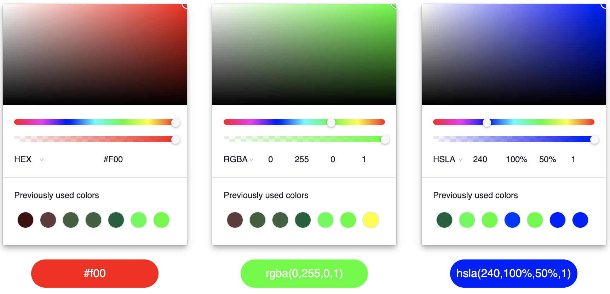

# v-color

> Simple color picker for `vue@2`

<div align="center" style="margin: 60px 0 40px">
  
</div>

## Install

With `npm`: 
```
npm install --save @uscreen-video/v-color
```

Or with `yarn`:

```
yarn add @uscreen-video/v-color
```

## Props

**`value`** – Color string in `hex`, `rgba` or `hsla` format

_type_: `string`

_default value_: `''`

---

**`withSuggestions`** – Enables colors suggestions which stores in local storage. Picker remembers 7 last colors

_type_: `boolean`

_default value_: `true`

## Events

**`input`** – Emits on each color change
